# Architecture

SumaiGuard Agent / 親の家 安全チェックAI is a local two-service POC for a narrow task: one photo in, cautiously worded visible fall, slip, or trip candidates out. It is not a medical, care-level, insurance, legal, construction, or final renovation judgment.

```mermaid
flowchart LR
    Browser["Browser / Japanese UI"] --> Web["sumai-web: FastAPI proxy"]
    Web --> Agent["sumai-agent: FastAPI"]
    Agent --> Intake["Pillow in to_thread: decode, EXIF strip, PNG pixels"]
    Intake --> Vision["async Gemini minimal facts or deterministic mock"]
    Vision --> Parse["strict facts parser"]
    Parse --> Rel["RelationshipEngine: validated triples"]
    Rel --> Ont["room-scoped OntologyRepository / room_checklists.yaml"]
    Ont --> Canon["canonicalize findings"]
    Canon --> Rules["deterministic RuleEngine and action tiers"]
    Rules --> Reports["deterministic report/advice text"]
    Reports --> Memo["process-local semantic and report TTL/LRU memo"]
    Memo --> Render["per-request annotated and improvement images"]
    Memo --> Response["JSON response with reusable report text"]
    Render --> Response
    Response --> Web
```

## Services and local boundary

- `sumai-agent` receives one image, processes it only in memory, and produces the analysis response. Image intake re-encodes sanitized pixels as PNG, thereby stripping EXIF; the original image and result are not persisted.
- `sumai-web` serves the Japanese browser experience and proxies multipart requests to the agent. The UI submits a weak `room_hint` (normally `auto`); it does not collect age, walking state, fall history, care level, disease, medication, or insurance data.
- Default local ports are agent `8080` and web `8081`. Mock mode remains available without credentials.

The public disclaimer is deliberate: this POC does not replace medical, care, insurance, or construction judgment, and the improvement image is communication material rather than a construction drawing.

The public response has an additive boolean `is_not_applicable`. Only `true` is neutral not-applicable: it is used for non-home, unknown-room, or explicit insufficient-evidence facts, requires empty findings/actions and a non-empty reason, and is carried through memo copies and the endpoint. `overall_risk_level` remains `low` in that wire-compatible response, but the web UI shows the neutral reason and hides risk summary, images, and suggestions.

For a known home room, `is_not_applicable=false` with ordinary empty findings instead means no obvious candidate was detected in the visible, validated scope. That remains the normal low-compatible result, not a neutral not-applicable state and not proof that the home is safe beyond the photo.

## Evidence and inference method

Gemini is limited to `VisionFacts`: environment, room type, visible regions, visible entities, feature observations, and relationships. The provider is not asked for severity, Japanese labels, action tiers, recommendations, reports, or final risk decisions.

`RelationshipEngine` accepts a visible hazard only when it has a complete, valid triple:

`subject entity ref` + `ontology predicate` + `target visible region/entity`.

The subject must be clear and the predicate/target must be configured for that ontology key. An expected feature becomes a missing-feature finding only when its state is `absent_with_full_coverage` and it has an in-bounds evidence bbox. `cannot_determine` produces no finding. This avoids treating cropped, obscured, or ambiguous areas as absent.

The bathroom safety correction is explicit: the expected feature is `has_shower_chair`; a negative observation is not represented as a fictional `no_shower` feature. Non-home, uncertain, unknown-room, or explicit not-applicable facts produce neutral not-applicable output, not a low-risk or no-risk claim.

Actual relationship inference preserves exact rule identity as `(room, ontology_key, rule_kind)`, where `rule_kind` distinguishes a visible hazard from a missing expected feature. `RiskFinding` carries that identity into `RuleEngine`, so duplicate `risk_type` values cannot silently select another rule's label, basis, or actions. The older risk-type-only lookup remains a compatibility fallback for legacy callers, not the relationship path.

The public `confidence` field remains for API compatibility and deterministic thresholding. Its provider-originated value is an uncalibrated model detection score, not a calibrated probability that the finding is correct. Ordinary reports therefore label it `モデル検出スコア（未校正）`, not confidence.

The public evidence bbox has positive width and height and must remain inside the normalized image frame. Danger selection, overlap suppression, annotated red boxes, canonical semantics, and benchmark validation all use that evidence bbox. Legacy boolean observations without an explicit `MissingSafetyFeature` or `visible_hazards` bbox cannot create a visual finding. Presentation mapping through visual zones or room anchors is improvement-image-only and cannot relocate evidence.

Canonicalization clears render-only `display_bbox` before sorting, winner selection, and semantic output. IoU deduplication at `IoU >= 0.5` first matches exact `(ontology_rule_kind, ontology_key)` identity. A `risk_type` fallback is used only when both findings are legacy findings without exact identity, so distinct ontology rules sharing one risk type retain their separate evidence and actions.

## Ontology and action policy

`apps/sumai_agent/app/knowledge_base/room_checklists.yaml` is the versioned, room-scoped source of truth. `OntologyRepository` validates its strict schema and exposes:

- `ontology_version`, `schema_version`, and `inference_config_version`;
- allowed relationship predicates and per-observation targets;
- rooms, visible hazards, and expected features;
- a source registry plus basis-to-source mapping; and
- action-tier policy and family-tier forbidden wording.

Ontology loading fails closed when a room repeats a key within `visible_hazards` or within `expected_features`. The same key may exist once in each collection because `rule_kind` is part of the exact identity. Validation errors expose safe field locations and messages without echoing the submitted ontology document.

Every generated known finding carries configured evidence source IDs. An empty source-ID list is allowed only for a basis explicitly mapped to no source; it is never invented at runtime. The rule engine, not Gemini, selects Japanese copy, severity, source basis, and the three action tiers:

- `家族で今日できること`: no-cost only;
- `ケアマネ・福祉用具に相談`: purchase, rental, or welfare-equipment consultation only; and
- `専門施工・現地確認`: professional construction or on-site confirmation only.

## Identity, canonical output, and memoization

Each HTTP request receives a random `analysis_id` for correlation only. It is intentionally different even when semantic work is reused.

`result_key` identifies computation inputs: sanitized pixel digest, normalized room hint, preprocess version, ontology version, `schema_version`, configured model, inference configuration version, and the execution policy (for example configured mock, strict Gemini, or Gemini with fallback). It does not contain raw image bytes.

`semantic_hash` identifies stable reader-facing semantics: room, home/not-applicable state and reason, canonical findings, and action plan. It excludes generated images, timings, execution mode, and render-only `display_bbox`; it includes the fixed not-applicable semantics described above. Findings are canonicalized before policy output so ordering, display mapping, and signed zero do not change the semantic result.

The memo is a bounded process-local TTL/LRU cache with in-flight coalescing. Its
value is the complete `ComputedAnalysis`: room and risk semantics, findings,
deterministic action tiers, generated report/advice text, mode/model metadata,
semantic hash, and the not-applicable state. Generated report/advice text is
cached and reused on a memo hit. Annotated and improvement images are rendered
for every request from the request-local sanitized pixels and cached findings;
uploaded bytes, sanitized PNG bytes, rendered image bytes, and PDF bytes are
outside the memo. PDF bytes are generated on demand and are not persisted or
cached.

TTL and maximum item count are configured by `RESULT_MEMO_TTL_SECONDS` and
`RESULT_MEMO_MAX_ITEMS` (source defaults: 300 seconds and 128 items). The memo
is process-local, not persistent, and not shared across worker processes. A
restart, eviction, TTL expiry, or request reaching another worker therefore
requires semantic computation again. Strict failures and non-strict fallback
results are uncached. These are source semantics, not evidence of deployed
values or worker topology.

Every completed result also shows the always-visible `analysis-mode-banner`, independent of the optional debug panel. It distinguishes `gemini`, `mock`, `local_mock`, and `gemini_fallback(...)`; mock and fallback wording explicitly says they are not Gemini analysis. Unknown modes receive a warning rather than an inferred provenance label.

Backend 400/422 input errors retain their HTTP status and return a fixed Japanese invalid-upload message; other 4xx responses likewise retain their status with a safe proxy message. Upstream detail is never forwarded. `local_mock` is reserved for non-strict transport failure, an invalid 200 JSON body, or the explicit non-strict 5xx fallback policy. It is a neutral abstention rather than a fabricated analysis: `is_not_applicable=true`, `room_type=auto`, empty findings/actions, a nonblank reason, and identical unannotated sanitized images. Each response gets a request-local `analysis_id`; equal inputs retain equal `result_key` and `semantic_hash`. The UI therefore hides risk summary, images, and suggestions. This availability fallback does not change the backend's ordinary deterministic mock capability.

## Async lifecycle and timing semantics

Pillow decode/sanitization and rendering run through `asyncio.to_thread`; Gemini uses a lazily created reusable async client. The web proxy likewise reuses an async `httpx` client. FastAPI lifespan shutdown closes both clients.

The agent timeout defaults to 120 seconds. The local web proxy adds a 30-second margin, yielding a default 150-second read budget. These are local POC settings, not a production SLO.

`stage_timings_ms` contains `intake`, `memo_lookup`, `vision`, `ontology`, `render`, `report`, `serialize`, and `total`. `total` is the sum of instrumented application stages after Pydantic dumping; it is **not HTTP end-to-end** latency. Starlette JSON encoding, socket time, and network time are excluded.

## Benchmark interpretation

The benchmark fixtures are synthetic and repeats are bounded to at most 50. In mock mode, P/R/F1 = 1 only checks that the deterministic pipeline matches those fixtures; it is **not recognition evidence** and must not be presented as visual-recognition accuracy. A real-mode benchmark requires strict status, a reviewed real-photo gold set, and reviewed labels before any accuracy claim.

Benchmark output separates schema validity from scoring applicability. `schema_valid_count` includes every schema-valid response. Schema-valid `is_not_applicable=true` results are abstentions, so they do not enter risk P/R/F1, including when the gold risk set is empty. `scored_applicable_response_count` and `scored_applicable_response_coverage` report scored applicable responses, with coverage using the repeated `request_count` as its denominator; `abstained_not_applicable_response_count` reports the excluded valid abstentions. When no applicable response was scored, risk metrics are unavailable with a reason rather than reporting an empty-set accuracy.

The public `AnalysisResponse` and benchmark schema validator enforce the same applicability state: neutral output is `room_type=auto`, `overall_risk_level=low`, empty findings and action tiers, and a nonblank reason; applicable output is a known home room with no neutral reason. This validation does not infer a different home-state rule for neutral output, because non-home, unknown-room, and insufficient-evidence cases are all valid abstentions.

## Cloud Run candidate and promotion boundary

Cloud Build is a candidate-only path: it tests the exact source, builds both
images, resolves each immutable digest, creates tagged agent and web revisions
at 0% production traffic, and emits identity-bound sanitized evidence. The
agent candidate must use `APP_CHECK_REQUIRED=true` and
`REQUIRE_REAL_GEMINI=true`; App Check is evaluated before reading the multipart
body. The web candidate must use `PUBLIC_WEB_ANALYSIS_ENABLED=false`. Local
mock mode remains available through the local Compose defaults and is not the
candidate configuration.

Source, exact-head CI, candidate deployment, real-device App Attest evidence,
the separate promotion checkpoint, production verification, archive/signing,
review, release, and storefront visibility are independent gates. Candidate
success does not authorize production traffic. Promotion is a separate script
whose default dry-run validates candidate evidence and real-device App Attest
evidence without mutation. Apply mode requires dual confirmation (the explicit
apply flag and exact confirmation phrase), then uses the Cloud Run Admin API
with `resourceVersion` compare-and-swap behavior and ownership-aware rollback.
Direct legacy deployment paths are retired.

This architecture describes the source contract only. It does not assert a
currently deployed candidate, current production revision, promotion, Apple
archive, review decision, release, or storefront availability. The safe
inspection script is read-only and cannot clear any release gate by itself.
