# Architecture

SumaiGuard Agent / 親の家 安全チェックAI is a local two-service POC for a narrow task: one photo in, cautiously worded visible fall, slip, or trip candidates out. It is not a medical, care-level, insurance, legal, construction, or final renovation judgment.

```mermaid
flowchart LR
    Browser["Browser / Japanese UI"] --> Web["sumai-web: FastAPI proxy"]
    Web --> Agent["sumai-agent: FastAPI"]
    Agent --> Intake["Pillow in to_thread: decode, EXIF strip, PNG pixels"]
    Intake --> Vision["async Gemini minimal facts or deterministic mock"]
    Vision --> Parse["strict facts parser"]
    Parse --> Rel["RelationshipEngine: validated triples"]
    Rel --> Ont["room-scoped OntologyRepository / room_checklists.yaml"]
    Ont --> Canon["canonicalize findings"]
    Canon --> Rules["deterministic RuleEngine and action tiers"]
    Rules --> Memo["process-local semantic TTL/LRU memo"]
    Memo --> Render["per-request render and report"]
    Render --> Response["JSON response"]
    Response --> Web
```

## Services and local boundary

- `sumai-agent` receives one image, processes it only in memory, and produces the analysis response. Image intake re-encodes sanitized pixels as PNG, thereby stripping EXIF; the original image and result are not persisted.
- `sumai-web` serves the Japanese browser experience and proxies multipart requests to the agent. The UI submits a weak `room_hint` (normally `auto`); it does not collect age, walking state, fall history, care level, disease, medication, or insurance data.
- Default local ports are agent `8080` and web `8081`. Mock mode remains available without credentials.

The public disclaimer is deliberate: this POC does not replace medical, care, insurance, or construction judgment, and the improvement image is communication material rather than a construction drawing.

## Evidence and inference method

Gemini is limited to `VisionFacts`: environment, room type, visible regions, visible entities, feature observations, and relationships. The provider is not asked for severity, Japanese labels, action tiers, recommendations, reports, or final risk decisions.

`RelationshipEngine` accepts a visible hazard only when it has a complete, valid triple:

`subject entity ref` + `ontology predicate` + `target visible region/entity`.

The subject must be clear and the predicate/target must be configured for that ontology key. An expected feature becomes a missing-feature finding only when its state is `absent_with_full_coverage` and it has an in-bounds evidence bbox. `cannot_determine` produces no finding. This avoids treating cropped, obscured, or ambiguous areas as absent.

The bathroom safety correction is explicit: the expected feature is `has_shower_chair`; a negative observation is not represented as a fictional `no_shower` feature. Non-home, uncertain, unknown-room, or explicit not-applicable facts produce neutral not-applicable output, not a low-risk or no-risk claim.

## Ontology and action policy

`apps/sumai_agent/app/knowledge_base/room_checklists.yaml` is the versioned, room-scoped source of truth. `OntologyRepository` validates its strict schema and exposes:

- `ontology_version`, `schema_version`, and `inference_config_version`;
- allowed relationship predicates and per-observation targets;
- rooms, visible hazards, and expected features;
- a source registry plus basis-to-source mapping; and
- action-tier policy and family-tier forbidden wording.

Every generated known finding carries configured evidence source IDs. An empty source-ID list is allowed only for a basis explicitly mapped to no source; it is never invented at runtime. The rule engine, not Gemini, selects Japanese copy, severity, source basis, and the three action tiers:

- `家族で今日できること`: no-cost only;
- `ケアマネ・福祉用具に相談`: purchase, rental, or welfare-equipment consultation only; and
- `専門施工・現地確認`: professional construction or on-site confirmation only.

## Identity, canonical output, and memoization

Each HTTP request receives a random `analysis_id` for correlation only. It is intentionally different even when semantic work is reused.

`result_key` identifies computation inputs: sanitized pixel digest, normalized room hint, preprocess version, ontology version, configured model, inference configuration version, and the execution policy (for example configured mock, strict Gemini, or Gemini with fallback). It does not contain raw image bytes.

`semantic_hash` identifies stable reader-facing semantics: room, home/not-applicable state and reason, canonical findings, and action plan. It excludes generated images, timings, execution mode, and `display_bbox`; it includes the fixed not-applicable semantics described above. Findings are canonicalized before policy output so ordering and signed zero do not change the semantic result.

The memo is a bounded process-local TTL/LRU cache with in-flight coalescing. It retains structured semantic output only—never images—and rendering still runs for every request. Strict failures and non-strict fallback results are uncached. The memo is neither persistent nor cross-process, so a restart or a different worker may call Gemini again.

## Async lifecycle and timing semantics

Pillow decode/sanitization and rendering run through `asyncio.to_thread`; Gemini uses a lazily created reusable async client. The web proxy likewise reuses an async `httpx` client. FastAPI lifespan shutdown closes both clients.

The agent timeout defaults to 120 seconds. The local web proxy adds a 30-second margin, yielding a default 150-second read budget. These are local POC settings, not a production SLO.

`stage_timings_ms` contains `intake`, `memo_lookup`, `vision`, `ontology`, `render`, `report`, `serialize`, and `total`. `total` is the sum of instrumented application stages after Pydantic dumping; it is **not HTTP end-to-end** latency. Starlette JSON encoding, socket time, and network time are excluded.

## Benchmark interpretation

The benchmark fixtures are synthetic and repeats are bounded to at most 50. In mock mode, P/R/F1 = 1 only checks that the deterministic pipeline matches those fixtures; it is **not recognition evidence** and must not be presented as visual-recognition accuracy. A real-mode benchmark requires strict status, a reviewed real-photo gold set, and reviewed labels before any accuracy claim.

## Cloud Run note

Historical Cloud Run configuration may exist in this repository, but Task9 neither modifies nor verifies deployment. This document is local-POC acceptance documentation, not a production-readiness claim. The existing 120-second deployment request limit and the 150-second local proxy budget remain an out-of-scope timeout compatibility risk; no Cloud Run behavior is asserted as verified here.
