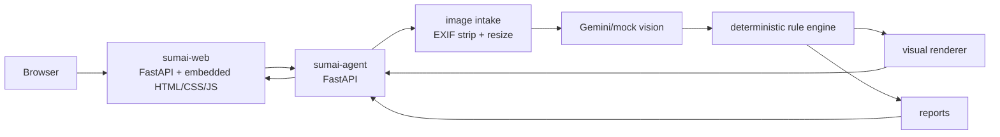
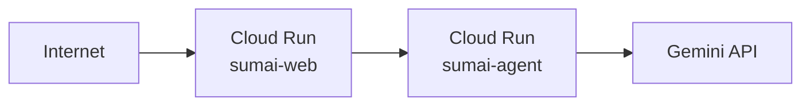

# Architecture

SumaiGuard Agent is a two-service application for preventive elderly home safety checking.

## Services

- `sumai-agent`: FastAPI AI agent. It receives one image, sanitizes it (EXIF strip, resize), gets visible-risk candidates from Gemini or mock mode, applies deterministic action-tier rules, renders red boxes and improvement overlays, and returns JSON with structured analysis.
- `sumai-web`: FastAPI web service serving an embedded HTML/CSS/vanilla JavaScript frontend. It keeps the Japanese user flow simple: use the six-place grid as capture guidance, upload or take one photo, begin analysis immediately, review risk boxes, and repeat after improvements. The frontend submits the room hint as `auto`. A hidden `?debug=1` panel can show the analysis mode, model, and backend response details during verification.

## Local Ports

- Backend: `http://localhost:8080`
- Frontend: `http://localhost:8081`

If another local project already uses these ports, change the compose port mapping locally and document that as an environment-specific adjustment.

## Cloud Run Deployment

Both services are deployed to Cloud Run in `asia-northeast1`:

- `sumai-agent`: Processes images, calls Gemini API, applies rules.
- `sumai-web`: Serves the embedded HTML/CSS/vanilla JavaScript UI and proxies analysis requests to the agent.

The web service discovers the agent URL via the `SUMAI_AGENT_URL` environment variable set during deployment.

## Data Flow

1. User uploads a photo via `sumai-web`.
2. `sumai-web` forwards the image to `sumai-agent /analyze`.
3. `sumai-agent` sanitizes the image (EXIF strip, resize to max 1600px).
4. Vision service (Gemini or mock) extracts visible risk findings.
5. Deterministic rule engine maps findings to action tiers.
6. Visual renderer draws red boxes and improvement overlays.
7. Report renderer generates Japanese markdown.
8. Full response (images, findings, actions, reports) returns to the frontend.

## Key Design Decisions

- Gemini provides risk candidates only; the deterministic rule engine controls action routing.
- Bbox coordinates are normalized to 0–1 range with compatibility for 0–1000 range.
- Structured JSON logging with analysis correlation IDs.
- Graceful fallback to mock mode on any Gemini failure.
- No image persistence — images are processed in memory only.
