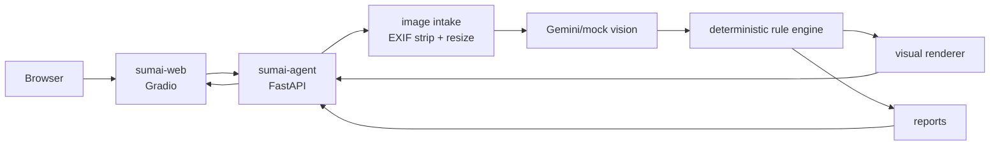

# Architecture

SumaiGuard Agent is a local two-service POC.

## Services

- `sumai-agent`: FastAPI AI agent. It receives one image, sanitizes it, gets visible-risk candidates from Gemini or mock mode, applies deterministic action-tier rules, renders red boxes, and returns JSON.
- `sumai-web`: Gradio frontend. It keeps the Japanese user flow simple: upload or take one photo, choose an optional room hint, analyze, review risk boxes, and repeat after improvements.

## Local Ports

- Backend: `http://localhost:8080`
- Frontend: `http://localhost:8081`

If another local project already uses these ports, change the compose port mapping locally and document that as an environment-specific adjustment.
