# SumaiGuard Ontology, Semantic Idempotency, and Latency Design

Date: 2026-07-29 JST
Status: Proposed for implementation
Scope: SumaiGuard Agent visible-risk analysis pipeline

## 1. Objective

For the same canonicalized home photo and the same room hint, preprocessing
version, schema version, ontology version, model identity, and inference
configuration:

1. Produce the same canonical semantic result.
2. Preserve visible-evidence-only safety boundaries.
3. Keep action routing deterministic and outside the LLM.
4. Reduce end-to-end latency without weakening recognition accuracy.
5. Preserve mock mode, strict real-Gemini mode, Japanese UI, EXIF stripping,
   in-memory image handling, and the three required action tiers.

The product remains a preventive elderly-home safety conversation aid. It does
not make medical, care-level, insurance, legal, subsidy-eligibility,
measurement, or construction decisions.

The external `/analyze` response remains backward compatible for the existing
Japanese frontend. Version and identity fields are additive. The existing
`bbox` field remains the evidence bbox; an optional `display_bbox` may be added
for rendering metadata without replacing the evidence coordinates.

## 2. First-Principles Constraints

- A schema can validate shape but cannot prove that a visual claim is true.
- A risk is derived from visible entities and their relationships, not from an
  unconstrained language-model conclusion.
- "Not visible" is not equivalent to "confirmed absent."
- An external vision-language model is not guaranteed to return the same
  ordering or wording on repeated calls.
- Exact replay across distributed instances requires shared persistence, which
  is outside this POC's no-persistence boundary.
- Python rules and geometry are cheaper and more deterministic than asking the
  model to generate severity, Japanese copy, evidence labels, actions, IDs, and
  ordering.

## 3. Approaches Considered

### Approach A: Prompt tuning only

Keep the current response model and add more prompt instructions, examples, and
temperature controls.

Advantages:

- Small code change.
- Preserves the current response shape.

Disadvantages:

- Does not provide semantic idempotency.
- Continues to trust model-generated severity, confidence, ordering, and text.
- Cannot represent relationships or distinguish missing evidence from evidence
  of absence.

Decision: rejected as the primary solution.

### Approach B: LLM-generated risk graph

Ask Gemini to return entities, relationships, risks, actions, and explanations
as a complete graph.

Advantages:

- Rich output.
- Fewer Python rules initially.

Disadvantages:

- Keeps risk derivation and policy decisions stochastic.
- Increases output tokens and latency.
- Makes ontology validation and safe action routing harder.

Decision: rejected because it violates the deterministic-policy boundary.

### Approach C: Minimal visual facts plus deterministic Python derivation

Gemini returns only scene classification, visible regions, typed visual
entities, normalized bounding boxes, and limited evidence states. Python owns
relationship calculation, risk derivation, stable IDs, sorting, Japanese copy,
evidence mapping, action tiers, and rendering.

Advantages:

- Best semantic stability.
- Smaller model output and lower latency.
- Keeps policy and Japanese claims deterministic.
- Supports explicit uncertainty and relationship evaluation.

Disadvantages:

- Requires a versioned ontology and migration of the current checklist data.
- Requires a real-photo evaluation corpus to calibrate thresholds.

Decision: selected.

## 4. Target Architecture

```mermaid
flowchart LR
    Upload[Upload] --> Intake[Canonical image intake]
    Intake --> Quality[Quality signals and pixel digest]
    Quality --> Key[Versioned result key]
    Key --> Memo{In-memory memo hit?}
    Memo -->|yes| Response[Canonical response]
    Memo -->|no| Vision[Async Gemini visual fact extraction]
    Vision --> Validate[Strict entity schema validation]
    Validate --> Graph[Python relationship graph]
    Graph --> Risks[Ontology risk derivation]
    Risks --> Policy[Deterministic action policy]
    Policy --> Canonical[Stable IDs sort and semantic hash]
    Canonical --> Render[Threaded visual and report rendering]
    Render --> Response
```



The web proxy uses a reusable asynchronous HTTP client. The agent uses a
reusable asynchronous Gemini client. CPU-bound image work runs outside the
event loop.

## 5. Versioned Domain Contract

### 5.1 Versions

The response and result key carry:

- `schema_version`
- `ontology_version`
- `preprocess_version`
- `model`
- `inference_config_version`

Changing any version invalidates semantic reuse.

### 5.2 Request and result identity

- `analysis_id`: unique per HTTP request and used only for tracing.
- `result_key`: deterministic SHA-256 of canonical pixel digest plus normalized
  room hint and all semantic versions.
- `semantic_hash`: deterministic SHA-256 of canonical semantic output,
  excluding request metadata, latency, logs, and rendered image bytes.

The complete HTTP response is not byte-identical because `analysis_id` remains
unique. The semantic result must be identical for cache hits.

### 5.3 Vision entities

Gemini may emit:

- Scene:
  - `environment`: `home`, `non_home`, or `uncertain`
  - `room_type`: one supported room or `unknown`
  - `visible_regions`: typed room regions visible in the photo
- Entities:
  - stable temporary entity reference
  - ontology entity type
  - normalized evidence bbox
  - visibility state: `clear`, `partial`, or `uncertain`
  - model score retained only as an uncalibrated model signal
- Explicit observations:
  - `present`, `absent_with_full_coverage`, or `cannot_determine`

Gemini must not emit actions, severity, institutional basis, final risk level,
construction advice, measurements, or free-form Japanese report text.

### 5.4 Ontology

The existing `room_checklists.yaml` becomes the single versioned ontology
source, loaded through typed Python models. Its top-level structure is migrated
from implicit room keys to explicit metadata, rooms, entities, risk rules,
action policies, and evidence sources. Runtime code no longer maintains
separate handwritten vocabulary sets. It is not a vector database, graph
database, RAG system, or persistent knowledge store.

Core entity classes:

- `room`
- `region`
- `obstacle`
- `surface_state`
- `safety_feature`
- `evidence_region`
- `risk`
- `action`
- `evidence_source`

Core relationships:

- `located_in`
- `intersects`
- `obstructs`
- `adjacent_to`
- `expected_in`
- `supports_transfer_at`
- `may_cause`
- `mitigated_by`
- `routed_to`
- `supported_by`
- `requires_confirmation`

Every risk rule is room-scoped or explicitly room-agnostic. A lookup by
`risk_type` alone must not silently select the first definition from another
room.

### 5.5 Missing-feature rule

A missing-feature risk can be derived only when:

1. The ontology expects the feature in the detected room and region.
2. The relevant search region is fully visible.
3. The visual result explicitly states `absent_with_full_coverage`.
4. The evidence region is provided.

Partial coverage or uncertainty produces `cannot_determine` and no missing
feature risk.

### 5.6 Canonicalization

Python performs:

- bbox coordinate quantization;
- same-class IoU deduplication;
- relationship normalization;
- room-scoped risk derivation;
- ontology-controlled severity, Japanese label, evidence basis, and actions;
- stable entity and risk IDs;
- stable sorting by severity, ontology priority, risk type, and bbox;
- deterministic report text;
- separation of immutable `evidence_bbox` from optional `display_bbox`.

## 6. Idempotency Boundary

### 6.1 Allowed implementation

Use a bounded, process-local, short-TTL memo:

- stores no image bytes;
- key is the versioned `result_key`;
- value is the canonical structured result before per-request metadata;
- bounded by item count and TTL;
- concurrent identical requests share one in-flight computation;
- cached results are copied before attaching a new `analysis_id`.

The memo stores semantic entities, relationships, findings, actions, and report
text only. It does not store uploaded, sanitized, annotated, or improvement
image bytes. Each request renders from its current sanitized upload. Successful
real-Gemini and explicit mock results may be memoized. Provider errors,
timeouts, invalid responses, and non-strict fallback results are never
memoized.

### 6.2 Explicit limitation

The process-local memo cannot guarantee exact replay across Cloud Run
instances, restarts, ontology versions, or model versions. Shared persistence
is explicitly out of scope.

Mock mode remains deterministic and must use the same canonicalization path.
Strict real mode remains fail-closed and never falls back to mock.

## 7. Latency Design

### 7.1 Observability first

Record sanitized stage timings:

- `intake_ms`
- `memo_lookup_ms`
- `vision_ms`
- `ontology_ms`
- `render_ms`
- `serialize_ms`
- `total_ms`

Do not log image bytes, image hashes, raw Gemini text, personal data, EXIF, or
credentials.

### 7.2 Non-blocking I/O

- Reuse one lazy Gemini client.
- Use the SDK asynchronous generate-content API.
- Reuse one `httpx.AsyncClient` in the web proxy.
- Align proxy and agent timeout budgets.
- Ensure timeout cancellation can interrupt network awaits.

### 7.3 CPU isolation

Use thread offloading for:

- Pillow intake and encoding;
- visual rendering;
- any CPU-heavy image-quality calculation.

Ontology rules, canonicalization, and report generation remain synchronous
because they are small deterministic operations.

### 7.4 Payload reduction

Initial implementation retains PNG preprocessing and both response images to
avoid unmeasured accuracy and UI regressions.

Adaptive JPEG/WebP encoding, lower maximum dimensions, and lazy improvement
image rendering are deferred until a real-photo benchmark proves:

- critical-risk recall does not regress;
- small-obstacle bbox performance does not regress;
- response latency or payload improves materially.

This prevents a speed optimization from silently reducing safety accuracy.

## 8. Error Handling

- Invalid upload: HTTP 400 with a stable Japanese message.
- Strict Gemini unavailable, timeout, or invalid schema: HTTP 503 with no
  fallback and no provider-detail leakage.
- Non-strict real Gemini failure: existing clearly labeled deterministic mock
  fallback remains allowed.
- Ontology load or validation failure: fail application startup rather than
  run with incomplete safety rules.
- Unsupported entity or relationship: reject the provider payload in strict
  mode; use labeled fallback in non-strict mode.
- Cache failure: bypass the memo and continue; never change the safety result.
- Rendering failure: return an explicit analysis failure rather than a
  fabricated image.

## 9. Evaluation and Tests

### 9.1 Test-first behaviors

Add failing tests before each production change for:

- ontology loading and unique room-scoped rule identity;
- missing feature requires full visible-region coverage;
- LLM cannot provide severity, actions, or Japanese report text;
- stable IDs and stable canonical ordering;
- identical canonical input produces the same result key;
- request IDs remain unique while semantic hashes remain equal;
- bounded TTL memo hit, expiry, and copy isolation;
- concurrent identical requests invoke vision once;
- strict-mode schema failure remains HTTP 503;
- async Gemini client path is awaited;
- async web proxy does not call blocking `requests.post`;
- stage timings exist without image or digest leakage;
- existing mock, action-tier, visual, report, and strict-mode behaviors.

### 9.2 Evaluation interface

Add a benchmark/evaluation runner that accepts a manifest referencing
synthetic, public-domain, or explicitly consented de-identified images outside
the runtime upload path.

The repository must not commit private home photographs.

The repository includes only an example manifest referencing the existing
synthetic samples. A reviewed real-photo manifest is supplied separately when
authorized.

Reported metrics:

- schema validity;
- room classification;
- entity precision/recall/F1;
- relationship F1;
- risk precision/recall/F1 by risk type;
- high-severity recall;
- false-reassurance rate;
- non-home false-positive rate;
- bbox IoU hit rate;
- idempotency repeat rate;
- stage p50/p95 latency.

No current metric is claimed until such a reviewed gold set exists.

### 9.3 Suggested pilot gates

- schema validity: 100%;
- deterministic action-policy tests: 100%;
- semantic hash repeatability for memoized identical input: 10/10;
- high-severity recall: at least 90%;
- risk precision: at least 80%;
- false-reassurance rate: at most 5%;
- relationship F1: at least 85%;
- bbox IoU at 0.5 hit rate: at least 75%;
- deterministic local stages p95: at most 300 ms;
- initial real end-to-end target: p50 at most 4 seconds and p95 at most
  10 seconds.

The recognition gates must be reviewed against the actual gold-set composition
before government pilot claims.

## 10. Migration Sequence

1. Add ontology and canonical-result tests.
2. Add versioned ontology models and migrate current checklist definitions.
3. Add minimal vision-fact schema while retaining legacy parsing only for
   explicitly marked compatibility tests.
4. Add Python relationship/risk derivation and deterministic text/action
   mapping.
5. Add canonical pixel digest, result key, stable semantic hash, and stable IDs.
6. Add bounded in-memory memo and in-flight request coalescing.
7. Add stage timings.
8. Convert Gemini and web proxy calls to reusable asynchronous clients.
9. Add evaluation and benchmark runners.
10. Update architecture, Gemini integration, risk policy, and stability docs.
11. Run focused tests after every red-green cycle and the complete verification
    suite before completion.

## 11. Files Expected to Change

- `apps/sumai_agent/app/models.py`
- `apps/sumai_agent/app/config.py`
- `apps/sumai_agent/app/services/gemini_vision.py`
- `apps/sumai_agent/app/services/image_intake.py`
- `apps/sumai_agent/app/services/checklist_engine.py`
- `apps/sumai_agent/app/services/rule_engine.py`
- `apps/sumai_agent/app/services/orchestrator.py`
- `apps/sumai_agent/app/services/visual_renderer.py`
- `apps/sumai_agent/app/knowledge_base/room_checklists.yaml`
- new focused ontology/canonicalization/memo modules as justified by tests
- backend tests
- `apps/sumai_web/app.py`
- evaluation and benchmark scripts
- architecture, Gemini, risk-policy, and stability documentation

## 12. Out of Scope

- Persistent image or result storage.
- Shared distributed cache.
- RAG, vector databases, graph databases, or persistent knowledge stores.
- Authentication or user accounts.
- Elderly profile questionnaires.
- Product, brand, contractor, affiliate, or marketplace recommendations.
- Medical, care-level, insurance, legal, subsidy, measurement, or construction
  decisions.
- A default second LLM pass.
- Cloud deployment or traffic changes.
- Treating synthetic images or mock output as real-recognition evidence.

## 13. Verification

Existing verification:

```bash
./scripts/test_all.sh
```

New focused verification will include:

```bash
python3 -m pytest apps/sumai_agent/tests/test_ontology.py -q
python3 -m pytest apps/sumai_agent/tests/test_canonicalization.py -q
python3 -m pytest apps/sumai_agent/tests/test_idempotency.py -q
python3 -m pytest apps/sumai_agent/tests/test_async_pipeline.py -q
python3 scripts/benchmark_pipeline.py \
  --manifest evaluation/goldset_manifest.example.yaml \
  --repeat 10
```

Completion also requires:

- `git diff --check`
- reviewed `git diff`
- explicit `git status --short --branch`
- no staging or modification of the existing untracked
  `docs/preconsultation/` directory
