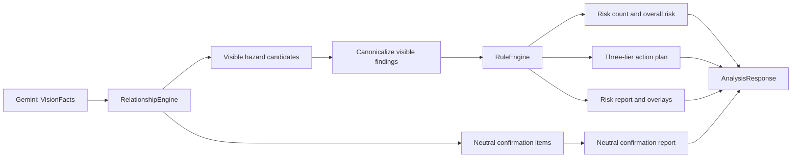

# SumaiGuard 可见风险原则重构设计

日期：2026-07-31 JST

状态：核心原则已获批准，等待书面规格复核

范围：单张住宅照片的风险语义、确定性行动策略、报告与结果页

## 1. 真实目标

让产品只把照片中直接可见、可定位、且有关系证据支持的跌倒、滑倒或绊倒危险
作为风险输出。照片中未确认到某项设备，只能形成中性的现场确认事项，不能被解释为
设备不存在、安装位置、风险、总体风险等级依据或购买／施工建议。

这不是一次显示层修补。目标是让模型输出到用户界面的整条数据链都遵守同一条语义
不变量。

## 2. 第一性原理

1. 一张照片能证明“画面中看到了什么”，不能证明“住宅中不存在什么”。
2. 风险必须有可见对象、可定位范围和关系证据；无可见证据就不能进入风险集合。
3. 中性的未确认事项和危险事实属于不同领域类型，不能共用 `RiskFinding`。
4. 总体风险、风险数量、红框和行动计划必须从同一个可见风险集合派生。
5. Gemini 只提供视觉事实；风险和三层行动策略仍由确定性 Python 规则决定。
6. 没有检测到可见风险不等于住宅安全，只表示当前照片内没有足够证据支持风险结论。

## 3. 已确认的根因

当前 `RelationshipEngine.derive()` 把满足
`absent_with_full_coverage` 的 `FeatureObservation` 构造成
`RiskFinding(ontology_rule_kind="expected_feature")`。这个对象随后进入：

- `RuleEngine.apply()`，产生家族、福祉用具和施工行动；
- `overall_risk_level()`，提高总体风险等级；
- `ReportRenderer`，形成风险详情；
- `/analyze` 的 `findings`，增加结果页风险数量；
- 语义哈希和进程内缓存；
- 前端，只在视觉层隐藏框和改善图。

因此上一版虽然不再画错误的框，仍然把“照片中未确认到设备”作为风险和行动来源。
这是领域模型混用造成的结构性错误，不是坐标算法或 CSS 错误。

## 4. 方案比较

### 方案 A：独立类型和独立输出通道（采用）

新增 `ConfirmationItem` 与 `confirmation_items`。`RiskFinding` 和
`findings` 只承载可见危险。关系引擎分别派生可见风险候选与中性确认事项；只有可见
风险进入规则引擎。

优点：

- 类型系统直接阻止语义泄漏；
- 风险数量、等级、标注和行动天然只依赖 `findings`；
- 保留对用户有帮助的中性确认信息；
- 混合结果也能清楚分开。

代价：

- 需要扩展响应契约、报告、前端和语义哈希；
- 需要对旧测试和基准验证器做明确迁移。

### 方案 B：保留在 `findings`，每个消费者过滤

继续使用 `ontology_rule_kind`，在规则、汇总、报告、渲染、前端和缓存各处过滤
`expected_feature`。

优点：接口变动较小。

缺点：任何新增消费者或漏掉的分支都可能再次把未确认事项当作风险；前一次修补已经
证明这个结构不可靠。

决定：拒绝。

### 方案 C：完全丢弃预期设备观察

不向用户返回任何未确认设备信息。

优点：实现最简单。

缺点：丢失了“照片不足以确认，需要现场核实”的有用边界信息；也不能解释模型为什么
没有对这些设备下结论。

决定：拒绝。

## 5. 目标领域契约

### 5.1 可见风险 `findings`

`AnalysisResponse.findings` 只允许：

- `ontology_rule_kind == "visible_hazard"`；
- 清晰可见的实体；
- 非整图占位框的归一化证据坐标；
- 满足本体定义的必需关系；
- 通过现有置信度和去重规则。

这些对象是下列输出的唯一数据源：

- 风险数量；
- 总体风险等级；
- 红色危险标注；
- 对策示意图；
- 三层行动计划；
- 风险详情报告。

`RuleEngine` 将增加防御性边界：即使未来有调用方错误传入非
`visible_hazard` 对象，也必须丢弃，不能产生行动。

### 5.2 中性现场确认事项 `confirmation_items`

新增独立类型，建议字段：

- `id`
- `feature_key`
- `label_ja`
- `description_ja`
- `confidence`
- `evidence_source_ids`
- `basis_label_ja`
- `basis_summary_ja`
- `needs_human_confirmation`，固定为 `true`

它不包含危险等级、`risk_type`、`risk_id`、行动层级或可绘制位置。Gemini 的
`evidence_bbox` 可以继续作为内部覆盖验证证据，但不进入公开确认事项，也不能用于
画框或推荐安装位置。

确认事项只在以下条件全部满足时派生：

1. 场景是已知住宅房间；
2. 特征在该房间的本体预期列表中；
3. 状态为 `absent_with_full_coverage`；
4. 覆盖证据框存在且不是整图占位框。

显示文案必须说明：

- 只是在当前照片中未确认到；
- 不能证明住宅内不存在；
- 不能判断是否有必要增设；
- 如有需要，应由人在现场核实。

### 5.3 零风险、混合和判定不能

- **只有确认事项**：`findings=[]`、风险数量 `0件`、总体风险 `低`、原图无框、
  无改善图、行动计划为空；可单独显示中性现场确认事项。
- **可见风险与确认事项并存**：数量、等级、图像和行动只计算可见风险；确认事项在
  独立中性区域显示。
- **无风险也无确认事项**：显示“当前照片中未检测到有足够证据的可见风险”，并提醒
  照片外情况未判断。
- **非住宅、未知房间或证据不足**：继续使用 `is_not_applicable=true`，不把它与
  “已分析且零个可见风险”混淆。

## 6. 数据流与职责



### 6.1 接口

`AnalysisResponse` 增加 `confirmation_items: list[ConfirmationItem]`，默认空列表
以兼容旧构造调用。响应 `schema_version` 升级，推理配置版本同步升级以失效旧
`result_key` 缓存身份。

`ComputedAnalysis`、语义载荷和 `semantic_hash` 包含确认事项；呈现坐标和图片字节
仍不进入语义哈希。

### 6.2 报告

风险摘要严格只遍历 `findings`。确认事项使用单独的中性标题，例如
“照片だけでは確認できない項目”，不得出现在行动 Markdown 中。

没有可见风险时，三个行动 Markdown 都明确写明“当前照片没有支持具体行动的可见
风险”，且不包含 `###` 行动条目。

### 6.3 前端

- 摘要标签从“确认项目”改为“可见风险”；
- 数量只读取 `payload.findings.length`；
- 中性卡片只读取 `payload.confirmation_items`；
- 没有可见风险时隐藏“次にできることを見る”；
- 只有可见风险时才显示改善图；
- 中性卡片不使用红、橙等风险色，不显示位置或设备安装候选。

## 7. 最小可验证交付

1. 新的类型化响应契约；
2. 关系引擎将风险与确认事项分流；
3. 规则引擎防御性拒绝非可见风险；
4. 风险、报告、语义哈希、缓存和前端使用新契约；
5. 完整回归测试；
6. 使用用户提供的卫生间照片进行真实 Gemini 分析；
7. 部署到 Cloud Run 并在用户 Chrome 中验收生产页面。

## 8. 预计修改文件

核心实现：

- `apps/sumai_agent/app/models.py`
- `apps/sumai_agent/app/services/relationship_engine.py`
- `apps/sumai_agent/app/services/orchestrator.py`
- `apps/sumai_agent/app/services/rule_engine.py`
- `apps/sumai_agent/app/services/report_renderer.py`
- `apps/sumai_agent/app/services/canonicalization.py`
- `apps/sumai_web/app.py`
- 版本化本体／推理配置文件（如版本由 YAML 管理）

测试：

- 关系、规则、报告、语义哈希、API、前端契约和真实流程相关测试；
- 新增“只有确认事项”和“风险与确认事项混合”回归用例。

文档：

- `docs/architecture.md`
- `docs/risk_policy.md`
- `docs/decisions.md`
- 必要的稳定性或接口说明。

实施中如发现新的调用方超出上述范围，将先盘点并说明，不扩大到无关重构。

## 9. 明确不在范围内

- 不改变 Gemini 供应商或模型；
- 不新增用户画像、健康、护理等级或保险问题；
- 不新增数据库、持久化、RAG、账户或 PDF；
- 不从单张照片推断尺寸、法规合规性或施工方案；
- 不重做 Apple 风格视觉系统；
- 不把紧急呼叫按钮或手扶设施定义为所有普通住宅的普遍必需项；
- 不修改用户的 `docs/preconsultation/` 未跟踪文件。

## 10. 风险与护栏

- **接口漂移**：用默认空列表、schema 版本和前后端契约测试控制。
- **旧缓存复用**：升级 schema／推理配置版本，验证相同图片得到新的
  `result_key`。
- **语义重新泄漏**：在模型验证器、关系引擎、规则引擎和端到端测试形成纵深防御。
- **Gemini 非确定性**：允许确认事项数量变化，但无论返回 0、1 或 2 项，只要没有
  可见危险，风险必须始终为 0、等级低、行动为空。
- **误报安全感**：零风险文案明确限定为当前照片，不宣称住宅安全。
- **真实识别未证明**：合成测试只验证契约；必须用实际卫生间照片和生产浏览器验收。

## 11. 验收标准

### 11.1 只有预期设备未确认

输入为当前卫生间照片，且 Gemini 只返回手扶设施／紧急呼叫设备的
`absent_with_full_coverage`：

- `findings == []`
- `overall_risk_level == "low"`
- `action_plan` 三层全部为空
- `confirmation_items` 可为 0 到本体允许的数量
- 风险数量显示 `0件`
- 原图无红框、无绿色／紫色改善框
- 改善图卡片隐藏
- “次にできることを見る”隐藏
- 中性事项不声称设备不存在或需要购买／施工

### 11.2 混合结果

输入同时包含 1 个可见危险和 2 个未确认设备：

- 风险数量为 `1件`
- 总体风险只由该可见危险的严重度决定
- 只绘制该危险的证据框
- 所有行动的 `risk_id` 只指向该可见危险
- 2 个确认事项单独显示，不进入任何行动层级

### 11.3 回归

- mock 模式和无凭证前端仍可运行；
- `is_not_applicable` 语义不变；
- EXIF 去除与不持久化图片不变；
- 三层行动政策对可见风险保持不变；
- 所有既有测试通过，旧的“expected feature 作为风险／行动”测试被新契约替换；
- Git diff 仅包含批准范围。

## 12. 验证命令与证据

实施阶段按 TDD 执行，先运行新测试并记录预期失败，再写生产代码。

重点测试示例：

```bash
PATH=/Library/Frameworks/Python.framework/Versions/3.13/bin:$PATH \
  ./.venv/bin/pytest \
  apps/sumai_agent/tests/test_relationship_engine.py \
  apps/sumai_agent/tests/test_rule_engine.py \
  apps/sumai_agent/tests/test_report_renderer.py \
  apps/sumai_agent/tests/test_canonicalization.py \
  apps/sumai_agent/tests/test_frontend_contract.py
```

完整门禁：

```bash
PATH=/Library/Frameworks/Python.framework/Versions/3.13/bin:$PATH \
  ./scripts/test_all.sh
```

部署前后还要验证：

- 用户卫生间照片的真实 Gemini `/analyze` 响应；
- Cloud Run 构建成功且新 revision 获得 100% 流量；
- 用户 Chrome 中 390px 级移动视口的风险数量、卡片、图片、按钮和控制台；
- `git diff --check`、提交差异审查和最终 `git status --short --branch`。
