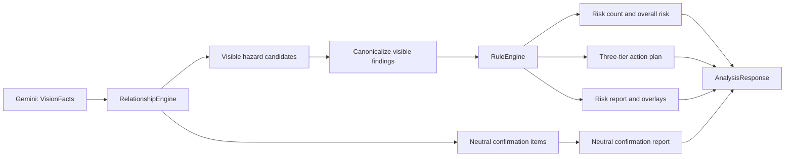

# SumaiGuard 可见风险原则重构设计

日期：2026-07-31 JST

状态：核心原则已获批准，等待书面规格复核

范围：单张住宅照片的风险语义、确定性行动策略、真实阶段等待体验、报告与结果页

## 1. 真实目标

让产品只把照片中直接可见、可定位、且有关系证据支持的跌倒、滑倒或绊倒危险
作为风险输出。照片中未确认到某项设备，只能形成中性的现场确认事项，不能被解释为
设备不存在、安装位置、风险、总体风险等级依据或购买／施工建议。

这不是一次显示层修补。目标是让模型输出到用户界面的整条数据链都遵守同一条语义
不变量，并让解析等待过程持续、诚实地反馈系统状态，而不是用固定计时器伪造进度。

## 2. 第一性原理

1. 一张照片能证明“画面中看到了什么”，不能证明“住宅中不存在什么”。
2. 风险必须有可见对象、可定位范围和关系证据；无可见证据就不能进入风险集合。
3. 中性的未确认事项和危险事实属于不同领域类型，不能共用 `RiskFinding`。
4. 总体风险、风险数量、红框和行动计划必须从同一个可见风险集合派生。
5. Gemini 只提供视觉事实；风险和三层行动策略仍由确定性 Python 规则决定。
6. 没有检测到可见风险不等于住宅安全，只表示当前照片内没有足够证据支持风险结论。
7. 用户需要确认系统仍在工作，但系统不能声称不知道的百分比或剩余时间。
8. 等待体验应优先使用已有处理过程和浏览器本地能力，不增加 Gemini 调用或轮询负载。

## 3. 已确认的根因

当前 `RelationshipEngine.derive()` 把满足
`absent_with_full_coverage` 的 `FeatureObservation` 构造成
`RiskFinding(ontology_rule_kind="expected_feature")`。这个对象随后进入：

- `RuleEngine.apply()`，产生家族、福祉用具和施工行动；
- `overall_risk_level()`，提高总体风险等级；
- `ReportRenderer`，形成风险详情；
- `/analyze` 的 `findings`，增加结果页风险数量；
- 语义哈希和进程内缓存；
- 前端，只在视觉层隐藏框和改善图。

因此上一版虽然不再画错误的框，仍然把“照片中未确认到设备”作为风险和行动来源。
这是领域模型混用造成的结构性错误，不是坐标算法或 CSS 错误。

## 4. 方案比较

### 方案 A：独立类型和独立输出通道（采用）

新增 `ConfirmationItem` 与 `confirmation_items`。`RiskFinding` 和
`findings` 只承载可见危险。关系引擎分别派生可见风险候选与中性确认事项；只有可见
风险进入规则引擎。

优点：

- 类型系统直接阻止语义泄漏；
- 风险数量、等级、标注和行动天然只依赖 `findings`；
- 保留对用户有帮助的中性确认信息；
- 混合结果也能清楚分开。

代价：

- 需要扩展响应契约、报告、前端和语义哈希；
- 需要对旧测试和基准验证器做明确迁移。

### 方案 B：保留在 `findings`，每个消费者过滤

继续使用 `ontology_rule_kind`，在规则、汇总、报告、渲染、前端和缓存各处过滤
`expected_feature`。

优点：接口变动较小。

缺点：任何新增消费者或漏掉的分支都可能再次把未确认事项当作风险；前一次修补已经
证明这个结构不可靠。

决定：拒绝。

### 方案 C：完全丢弃预期设备观察

不向用户返回任何未确认设备信息。

优点：实现最简单。

缺点：丢失了“照片不足以确认，需要现场核实”的有用边界信息；也不能解释模型为什么
没有对这些设备下结论。

决定：拒绝。

## 5. 目标领域契约

### 5.1 可见风险 `findings`

`AnalysisResponse.findings` 只允许：

- `ontology_rule_kind == "visible_hazard"`；
- 清晰可见的实体；
- 非整图占位框的归一化证据坐标；
- 满足本体定义的必需关系；
- 通过现有置信度和去重规则。

这些对象是下列输出的唯一数据源：

- 风险数量；
- 总体风险等级；
- 红色危险标注；
- 对策示意图；
- 三层行动计划；
- 风险详情报告。

`RuleEngine` 将增加防御性边界：即使未来有调用方错误传入非
`visible_hazard` 对象，也必须丢弃，不能产生行动。

### 5.2 中性现场确认事项 `confirmation_items`

新增独立类型，字段固定为：

- `id`
- `feature_key`
- `label_ja`
- `description_ja`
- `confidence`
- `evidence_source_ids`
- `basis_label_ja`
- `basis_summary_ja`
- `needs_human_confirmation`，固定为 `true`

它不包含危险等级、`risk_type`、`risk_id`、行动层级或可绘制位置。Gemini 的
`evidence_bbox` 可以继续作为内部覆盖验证证据，但不进入公开确认事项，也不能用于
画框或推荐安装位置。

确认事项只在以下条件全部满足时派生：

1. 场景是已知住宅房间；
2. 特征在该房间的本体预期列表中；
3. 状态为 `absent_with_full_coverage`；
4. 覆盖证据框存在且不是整图占位框。

显示文案必须说明：

- 只是在当前照片中未确认到；
- 不能证明住宅内不存在；
- 不能判断是否有必要增设；
- 如有需要，应由人在现场核实。

### 5.3 零风险、混合和判定不能

- **只有确认事项**：`findings=[]`、风险数量 `0件`、可见风险等级仍为 `低`，
  但照片判定状态必须为 `needs_on_site_confirmation`，界面显示“现地确认が必要”；
  原图无框、无改善图、行动计划为空；可单独显示中性现场确认事项。不得把
  “当前照片未形成可见风险”呈现为住宅总体风险低。
- **可见风险与确认事项并存**：数量、等级、图像和行动只计算可见风险；确认事项在
  独立中性区域显示。
- **无风险也无确认事项**：显示“当前照片中未检测到有足够证据的可见风险”，并提醒
  照片外情况未判断。
- **非住宅、未知房间或证据不足**：继续使用 `is_not_applicable=true`，不把它与
  “已分析且零个可见风险”混淆。

## 6. 数据流与职责



### 6.1 接口

`AnalysisResponse` 增加 `confirmation_items: list[ConfirmationItem]`，默认空列表
以兼容旧构造调用。响应 `schema_version` 升级，推理配置版本同步升级以失效旧
`result_key` 缓存身份。

在真实照片验证中补充 `assessment_status`，把“可见危险等级”和“证据是否完整”
分开表达：

- 有 `findings`：`visible_risks_found`；
- 无 `findings` 但有 `confirmation_items`：`needs_on_site_confirmation`；
- 两者都没有：`no_visible_risks_found`；
- 不适用或判定保留：`not_applicable`。

该状态完全由结构化结果确定性派生，Gemini 不能直接设置。

`ComputedAnalysis`、语义载荷和 `semantic_hash` 包含确认事项；呈现坐标和图片字节
仍不进入语义哈希。

### 6.2 报告

风险摘要严格只遍历 `findings`。确认事项使用固定的中性标题
“写真だけでは確認できない項目”，不得出现在行动 Markdown 中。

没有可见风险时，三个行动 Markdown 都明确写明“当前照片没有支持具体行动的可见
风险”，且不包含 `###` 行动条目。

### 6.3 前端

- 摘要标签从“确认项目”改为“可见风险”；
- 可见注意箇所数量只读取 `payload.findings.length`；
- 现场确认数量只读取 `payload.confirmation_items.length`；
- 页面不得使用“总体风险低”概括确认事项尚未解决的结果；确认事项存在且没有
  可见风险时，必须显示“现地確認が必要”；
- 中性卡片只读取 `payload.confirmation_items`；
- 没有可见风险时隐藏“次にできることを見る”；
- 只有可见风险时才显示改善图；
- 中性卡片不使用红、橙等风险色，不显示位置或设备安装候选。

## 7. B1 真实阶段等待体验

### 7.1 已选方向

用户已在浏览器视觉方案中选择 B1：

- 后端真实处理阶段；
- 无百分比活动条；
- 照片上的安静扫描动画；
- 每 5 秒轮播一条本地高龄者安全小贴士。

拒绝显示虚假百分比或剩余秒数。真实分析时间会随 Gemini、图片、缓存和网络波动；
一个计时器驱动的百分比必然可能停在高位，反而增加焦虑并损害安全产品的可信度。

### 7.2 真实阶段契约

保留 Agent 与 Web 现有同步 `/analyze` 接口供兼容调用方使用，并在两层新增固定路径
`/analyze/stream`。浏览器通过一个 `fetch` POST 请求上传图片，Web 代理将 Agent 的
NDJSON 响应逐块转发，浏览器从同一响应读取阶段事件和最终结果。不使用轮询、数据库、
后台任务表或第二次 Gemini 请求。

阶段只在真实边界发生时更新：

1. `intake_complete`：图片读取、格式检查、EXIF 去除和规范化完成；
2. `vision_complete`：Gemini 视觉事实提取完成，或缓存中已有语义结果；
3. `result_complete`：确定性本体、规则、报告和图片渲染完成，并附带完整
   `AnalysisResponse`。

前端初始显示第一阶段进行中。收到阶段完成事件后，才把该阶段标记为完成并激活下一
阶段。中间等待期间只播放活动条和扫描动画，不推算百分比。

正常文案改为：

- `写真を安全に処理`
- `見える範囲を解析`
- `結果を整理`

删除当前计时器驱动的 `写真確認 → リスク判定 → 改善案作成`。最后两项可能在零风险
结果中暗示系统一定判定出风险并创建改善方案，与新的可见风险原则冲突。

### 7.3 流式数据与兼容性

每一行 NDJSON 使用最小事件信封：

```json
{"type":"progress","stage":"intake_complete"}
{"type":"progress","stage":"vision_complete"}
{"type":"result","payload":{"analysis_id":"..."}}
{"type":"error","error":"gemini_unavailable","message":"解析サービスは現在利用できません。"}
```

`result` 事件等价于 `result_complete`。错误使用上述安全的公开错误事件，不传递
供应商正文、密钥或图片内容。连接断开时取消
当前请求范围内仍可取消的工作；不能安全取消的供应商调用按现有超时结束。前端显示
现有日文错误状态，不把未完成阶段标记为完成。

进程内 memo 命中可能使第二、三阶段快速连续完成，这是正确行为。并发相同请求的
跟随者没有独立的 Gemini 阶段时，可保持“解析中”直到共享结果完成，不伪造所有者的
内部进度。

如果浏览器不能逐块读取流，完整响应到达后仍可顺序解析所有 NDJSON 行并显示结果；
现有非流式接口继续作为兼容与诊断路径，不在已经开始分析后自动重复提交相同图片。

### 7.4 浏览器本地动画与小贴士

照片扫描、活动条和提示卡切换只使用 CSS 与少量原生 JavaScript。不得新增动画库、
远程字体、网络图片或 AI 调用。

预置三条谨慎、非个性化、无购买和无医疗判断的小贴士：

1. `床が濡れていたら、早めに拭きましょう。`
2. `通り道に物がないか、無理のない範囲で確認しましょう。`
3. `夜間に足元が見える明るさか、家族と確認しましょう。`

每 5 秒显示一条，只渲染一个提示卡；切换不触发网络请求。页面切到后台或结果到达后
停止计时器。`prefers-reduced-motion: reduce` 时停止扫描、活动条位移和卡片过渡，
保留静态“解析中”状态。阶段变化使用 `aria-live="polite"`，小贴士不反复播报，避免
打扰屏幕阅读器用户。

### 7.5 长等待与错误

- 超过 20 秒仍未完成时，显示
  `通常より時間がかかっていますが、解析は続いています。`；
- 不显示剩余秒数、百分比或“即将完成”；
- 超时时沿用现有安全失败／严格 Gemini 行为；
- 用户返回主页时停止前端动画和小贴士计时器；是否取消上传请求作为实现细节测试，
  不新增常驻后台任务；
- 最终结果到达后立即停止所有等待动画，再进行结果页切换。

## 8. 最小可验证交付

1. 新的类型化响应契约；
2. 关系引擎将风险与确认事项分流；
3. 规则引擎防御性拒绝非可见风险；
4. 风险、报告、语义哈希、缓存和前端使用新契约；
5. B1 真实阶段流、无百分比活动条和本地小贴士；
6. 完整回归测试；
7. 使用用户提供的卫生间照片进行真实 Gemini 分析；
8. 部署到 Cloud Run 并在用户 Chrome 中验收生产页面。

## 9. 预计修改文件

核心实现：

- `apps/sumai_agent/app/models.py`
- `apps/sumai_agent/app/main.py`
- `apps/sumai_agent/app/services/relationship_engine.py`
- `apps/sumai_agent/app/services/orchestrator.py`
- `apps/sumai_agent/app/services/rule_engine.py`
- `apps/sumai_agent/app/services/report_renderer.py`
- `apps/sumai_agent/app/services/canonicalization.py`
- `apps/sumai_web/app.py`
- 版本化本体／推理配置文件（如版本由 YAML 管理）

测试：

- 关系、规则、报告、语义哈希、API、前端契约和真实流程相关测试；
- 新增“只有确认事项”和“风险与确认事项混合”回归用例。

文档：

- `docs/architecture.md`
- `docs/risk_policy.md`
- `docs/decisions.md`
- 必要的稳定性或接口说明。

实施中如发现新的调用方超出上述范围，将先盘点并说明，不扩大到无关重构。

## 10. 明确不在范围内

- 不改变 Gemini 供应商或模型；
- 不新增用户画像、健康、护理等级或保险问题；
- 不新增数据库、持久化、RAG、账户或 PDF；
- 不从单张照片推断尺寸、法规合规性或施工方案；
- 不显示虚假进度百分比或剩余时间；
- 不为小贴士新增 AI、网络、数据库、轮询或个性化处理；
- 不重做 Apple 风格视觉系统；
- 不把紧急呼叫按钮或手扶设施定义为所有普通住宅的普遍必需项；
- 不修改用户的 `docs/preconsultation/` 未跟踪文件。

## 11. 风险与护栏

- **接口漂移**：用默认空列表、schema 版本和前后端契约测试控制。
- **旧缓存复用**：升级 schema／推理配置版本，验证相同图片得到新的
  `result_key`。
- **语义重新泄漏**：在模型验证器、关系引擎、规则引擎和端到端测试形成纵深防御。
- **Gemini 非确定性**：允许确认事项数量变化，但无论返回 0、1 或 2 项，只要没有
  可见危险，风险必须始终为 0、等级低、行动为空。
- **误报安全感**：零风险文案明确限定为当前照片，不宣称住宅安全。
- **真实识别未证明**：合成测试只验证契约；必须用实际卫生间照片和生产浏览器验收。
- **进度失真**：只有真实事件能完成阶段；活动条不表达完成比例。
- **资源开销**：单个流式响应替代单个同步响应，不轮询；动画和小贴士仅在浏览器运行。
- **可访问性**：支持减少动态效果；阶段才使用礼貌播报，小贴士不重复播报。
- **断流或超时**：不自动重复提交已经开始的分析；保留安全、可读的错误状态。

## 12. 验收标准

### 12.1 只有预期设备未确认

输入为当前卫生间照片，且 Gemini 只返回手扶设施／紧急呼叫设备的
`absent_with_full_coverage`：

- `findings == []`
- `overall_risk_level == "low"`
- `action_plan` 三层全部为空
- `confirmation_items` 可为 0 到本体允许的数量
- 风险数量显示 `0件`
- 原图无红框、无绿色／紫色改善框
- 改善图卡片隐藏
- “次にできることを見る”隐藏
- 中性事项不声称设备不存在或需要购买／施工

### 12.2 混合结果

输入同时包含 1 个可见危险和 2 个未确认设备：

- 风险数量为 `1件`
- 总体风险只由该可见危险的严重度决定
- 只绘制该危险的证据框
- 所有行动的 `risk_id` 只指向该可见危险
- 2 个确认事项单独显示，不进入任何行动层级

### 12.3 B1 等待体验

- 删除固定 1.2 秒／2.6 秒的 `setTimeout` 假阶段；
- 未收到后端事件时，阶段不会自行完成；
- 收到三类真实事件时，UI 按顺序更新并最终渲染结果；
- 活动条没有百分比、宽度完成值或剩余时间；
- 三条小贴士来自本地静态数组，不产生额外 HTTP 或 Gemini 请求；
- 20 秒后显示诚实的长等待文案，结果到达后立即清除；
- 结果、错误、返回主页和页面隐藏均停止相关计时器；
- `prefers-reduced-motion` 下没有扫描或位移动画；
- 390×844 下照片、阶段、活动条和提示卡无需横向滚动；
- 流式和原有非流式 API 都保持严格错误边界。

### 12.4 回归

- mock 模式和无凭证前端仍可运行；
- `is_not_applicable` 语义不变；
- EXIF 去除与不持久化图片不变；
- 三层行动政策对可见风险保持不变；
- 所有既有测试通过，旧的“expected feature 作为风险／行动”测试被新契约替换；
- Git diff 仅包含批准范围。

## 13. 验证命令与证据

实施阶段按 TDD 执行，先运行新测试并记录预期失败，再写生产代码。

重点测试示例：

```bash
PATH=/Library/Frameworks/Python.framework/Versions/3.13/bin:$PATH \
  ./.venv/bin/pytest \
  apps/sumai_agent/tests/test_relationship_engine.py \
  apps/sumai_agent/tests/test_rule_engine.py \
  apps/sumai_agent/tests/test_report_renderer.py \
  apps/sumai_agent/tests/test_canonicalization.py \
  apps/sumai_agent/tests/test_frontend_contract.py \
  apps/sumai_agent/tests/test_streaming_analysis.py
```

完整门禁：

```bash
PATH=/Library/Frameworks/Python.framework/Versions/3.13/bin:$PATH \
  ./scripts/test_all.sh
```

部署前后还要验证：

- 用户卫生间照片的真实 Gemini `/analyze` 响应；
- Cloud Run 构建成功且新 revision 获得 100% 流量；
- 用户 Chrome 中 390px 级移动视口的等待动画、真实阶段、小贴士、风险数量、卡片、
  图片、按钮和控制台；
- `git diff --check`、提交差异审查和最终 `git status --short --branch`。
