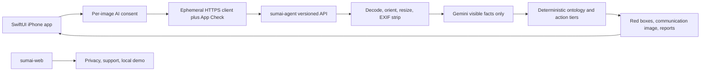

# SumaiGuard Native iOS App Store Release Design

**Date:** 2026-08-08
**Status:** Approved design; implementation has not started
**Public product name:** `親の家 安全チェック`
**Repository:** `/Users/zhanglonglong/Projects/apps/sumai-guard-agent`

## 1. Real objective and governing principle

The objective is to release a maintainable, Japanese, native iPhone app on the
Japan App Store and verify that both the storefront and the real production
analysis path work. A TestFlight build, an App Review approval, a Cloud Run
deployment, or a healthy endpoint is not sufficient by itself.

The governing rules are:

- Goal before options: ship a useful native safety-checking tool, not a wrapped
  website.
- Risk before speed: privacy, physical-safety wording, abuse control, and
  rollback evidence gate the release.
- Value before effort: keep the one-photo flow and reuse the existing typed,
  deterministic risk pipeline.
- Evidence before optimism: each external state receives its own observed gate.

## 2. Minimum verifiable deliverable

The first implementation deliverable is one iPhone-only App Review candidate
that satisfies all local, backend-candidate, simulator, real-device, archive,
export, privacy, and metadata gates.

The overall release is complete only after all of these are observed:

1. Apple Distribution archive and App Store Connect export succeed.
2. The intended build is uploaded and processed.
3. App Review is submitted and approved.
4. The version is explicitly released.
5. The direct Japanese storefront product page is reachable.
6. A privacy-safe production smoke test succeeds after release.

## 3. Current evidence snapshot

This snapshot is context, not permanent release proof:

- Source identity was `5a4421501d90de4af70b7891a141378d7becbe3d` on
  `main`, aligned with `origin/main` when the design audit began.
- `docs/preconsultation/` was pre-existing, untracked user material and must
  remain unmodified and unstaged.
- An isolated dependency environment passed 373/373 Python tests, frontend
  import, and `docker compose config`.
- Xcode 26.6, iOS simulators, Apple Development, and Apple Distribution
  identities were present on the development Mac.
- `sumai-agent` and `sumai-web` were serving 100% traffic in
  `asia-northeast1`, with strict Gemini mode and a Secret Manager reference.
- The public `/status` endpoint returned 200, while the audited `/healthz` and
  both `/privacy` endpoints returned 404.
- The repository had no iOS or Xcode project.
- The existing `cloudbuild.yaml` deployed zero-traffic candidates but promoted
  them automatically in the same build.
- The legacy GitHub deployment workflow could perform a separate source deploy
  and could pass a Gemini key as an ordinary environment value.

Every time-sensitive item above must be reverified during implementation.

## 4. Product identity

| Field | Required value |
|---|---|
| App Store name | `親の家 安全チェック` |
| Home-screen display name | `親の家チェック` |
| Japanese subtitle | `写真で注意箇所と相談先を整理` |
| Bundle identifier | `com.zll.sumaiguard` |
| Marketing version | `1.0` |
| Initial build number | `1` |
| Default language | Japanese |
| Initial storefront | Japan |
| Primary category | Lifestyle |
| Secondary category | Utilities |
| Device family | iPhone only |
| Minimum OS | iOS 17.0 |
| Orientation | Portrait |

The selected icon direction is a dark, low-saturation green field with a
cream-colored home and check mark. It must remain legible at notification-icon
size and must not use a medical cross, an elderly-person silhouette, a robot,
or AI sparkle imagery.

## 5. Product boundary

The native app preserves the repository boundary:

- One photo in; visible fall, slip, or trip candidates out.
- Red boxes identify only visible evidence.
- Gemini returns minimal visible facts only.
- Deterministic rules own risk labels, cautious Japanese copy, and action tiers.
- Advice is divided into the three existing tiers.
- A Japanese text-only PDF copies the current advice and risk basis.

The release does not add:

- iPad-specific UI, Android, accounts, sign-in, user profiles, or history;
- age, disease, medication, walking state, care level, insurance, or fall-history
  questions;
- persistent images, results, PDFs, user identifiers, or quota records;
- advertising, payment, analytics tracking, push notifications, or community
  content;
- medical, care-level, insurance, subsidy, legal-compliance, exact-measurement,
  or construction judgments;
- a vector database, RAG system, or persistent knowledge store.

## 6. System architecture



The native app calls `sumai-agent` directly. It never embeds the existing web
UI in a `WKWebView`.

`sumai-web` keeps the existing local/mock browser experience and becomes the
public host for `/privacy` and `/support`. Real public browser analysis is
disabled in the production configuration for this release because it cannot
present an iOS App Attest token and would otherwise bypass the native abuse
gate. This does not remove the local mock-mode web POC.

## 7. Native module boundaries

The iOS target is decomposed as follows:

- `App/SumaiGuardApp.swift`: application entry point and production dependency
  composition.
- `ViewModels/AppFlowCoordinator.swift`: the only owner of screen transitions
  and pending in-memory state.
- `Services/APIClient.swift`: validated HTTPS origin, App Check header,
  multipart request, stable response decoding, and safe error mapping.
- `Services/AppCheckBootstrap.swift`: Firebase initialization and production
  App Attest provider selection.
- `Services/ImageSanitizer.swift`: orientation normalization, dimension limit,
  JPEG re-encoding, metadata removal, and byte limit.
- `Services/SafetyPDFRenderer.swift`: on-device, text-only PDF generation with
  the approved disclaimer.
- `Models/AnalysisResponse.swift`: exact typed representation of the public API.
- `Views/*`: one focused SwiftUI view per app state.
- `Resources/Assets.xcassets`: opaque AppIcon assets and visual resources.
- `SumaiGuardTests/*`: state, transport, security, rendering, and release
  contract tests.

No view starts a network request directly. Views emit actions to the
coordinator, which calls a protocol-backed service.

## 8. Native screen and state design

The approved flow is:

`capture -> consent -> processing -> result -> advice`

Independent terminal states are `notApplicable`, `noFindings`, and `error`.

### 8.1 Capture

- Show six-place capture guidance.
- Offer `カメラで撮影` and `写真から選ぶ`.
- Use `PhotosPicker` so full photo-library permission is unnecessary.
- Show `写真は保存しません`, the visible-scope boundary, and a privacy link.

### 8.2 Consent

Before every upload, including every retry, show:

- the selected image preview;
- the purpose of visible-risk extraction;
- the SumaiGuard Cloud Run backend and Google Gemini by Google LLC;
- the possibility that a home image contains personal or sensitive context;
- the no-application-persistence statement;
- `同意して解析する` and `キャンセル`.

Cancel clears the pending image and causes zero analysis requests.

### 8.3 Processing

- Show the selected image and an indeterminate progress treatment.
- Do not display fabricated progress percentages.
- Allow cancellation, cancel the active URL task, and clear temporary state.

### 8.4 Result

- Use `写真で確認できた注意箇所`, not diagnosis language.
- Stack the red-box evidence image and improvement communication image
  vertically.
- Show each candidate's visible basis and uncalibrated model score.
- Consolidate what one photo cannot determine.
- Route to the advice screen through `安全のためにできること`.

`noFindings` says only that no obvious candidate was confirmed in the visible
scope. `notApplicable` hides risk and advice content and asks for a suitable new
photo. Neither state says that the home is safe.

### 8.5 Advice and PDF

The advice screen shows exactly:

- `家族で今日できること`: no-cost actions only;
- `ケアマネ・福祉用具に相談`: purchase, rental, or welfare-equipment
  consultation only;
- `専門施工・現地確認`: construction or on-site professional confirmation.

The PDF is rendered on device and shared through the system share sheet. It
contains no photo, debug field, token, request ID, model payload, or new history.

### 8.6 Visual and accessibility direction

- Calm Apple-native utility design with a low-saturation green accent.
- No purple-blue gradients, scan rings, robot icons, or AI sparkle imagery.
- Dynamic Type, VoiceOver labels, light/dark mode, Reduce Motion, and at least
  44-point controls are required.
- Returning home clears all images, results, PDF data, and pending tasks.

## 9. Image and analysis data flow

1. The user chooses or captures one image.
2. The app retains it in memory and moves to consent without network activity.
3. After agreement, `ImageSanitizer` normalizes orientation, limits the longest
   side to 1600 pixels, re-encodes JPEG pixels without metadata, and enforces a
   10 MiB upload ceiling.
4. The app obtains a valid Firebase App Check token and sends it only in the
   `X-Firebase-AppCheck` header.
5. `sumai-agent` validates the token before reading the multipart body.
6. The server enforces content type and size, re-decodes pixels, strips metadata
   again, and runs the existing pipeline.
7. Gemini receives only the sanitized image and visible-facts prompt.
8. Deterministic code produces actions, images, and reports.
9. The API returns a typed JSON response with `Cache-Control: no-store`.
10. The app renders the result and discards it when the flow resets or the
    process ends.

The server's existing bounded process-local semantic cache may retain structured
semantic output for its short configured TTL. It must never retain an image and
is not persistent across workers or restarts.

## 10. API contract

### Public operational endpoints

- `GET /health`: liveness, version, and a stable `status: ok` only.
- `GET /ready`: safe readiness state without secret presence, credentials, or
  provider error details.

`/healthz` remains only a compatibility alias in local tests. Release and review
documents use `/health` because the audited Cloud Run URL returned a platform
404 for `/healthz`.

### Analysis endpoint

`POST /api/v1/analyze` accepts `multipart/form-data`:

- `image`: sanitized JPEG from the native client;
- `room_hint`: `auto` or one of the existing room identifiers.

Production requires `X-Firebase-AppCheck`. Missing, invalid, expired, wrong-app,
or malformed tokens receive a stable unauthorized response before image intake.

The response reuses the existing `AnalysisResponse` semantics, including mode,
model, applicability, cautious reason, findings, action plan, annotated images,
reports, and stage timings. Internal cache metadata remains private.

The legacy `POST /analyze` route remains for compatibility. When production
App Check enforcement is enabled, it requires the same valid token. Local mock
mode may call it without Firebase credentials.

### Stable errors

| HTTP | Public code | Meaning |
|---|---|---|
| 400 | `INVALID_IMAGE` | Image cannot be decoded or validated |
| 401 | `APP_CHECK_INVALID` | Missing or invalid attestation token |
| 413 | `IMAGE_TOO_LARGE` | Upload exceeds the byte or dimension contract |
| 429 | `SERVICE_LIMITED` | Service or provider quota is temporarily bounded |
| 503 | `GEMINI_UNAVAILABLE` | Strict real Gemini analysis is unavailable |
| 500 | `INTERNAL_ERROR` | Generic failure without internal detail |

Python exception messages, provider payloads, raw user content, and Gemini
details are never returned to the client.

## 11. App Check and App Attest boundary

The iOS Release configuration uses Firebase App Check with Apple's App Attest
provider and the production App Attest entitlement. Simulator and CI builds may
use the Firebase debug provider only in an explicit Debug configuration. The
Release validator rejects debug providers, debug tokens, and sandbox
entitlements.

The Python backend verifies baseline tokens with
`firebase_admin.app_check.verify_token()` and checks the expected Firebase app
identity. The Firebase App Check token TTL is configured to 30 minutes to reduce
the usefulness of a leaked token while staying within the supported 30-minute to
7-day range.

### Replay-protection correction

Firebase's documented custom-backend replay-protection beta supports token
consumption only in the Node.js Admin SDK. The Python Admin SDK verifies tokens
but cannot consume them. Therefore this release does not claim single-use token
or replay protection.

The app uses ordinary App Check tokens. Adding a Node.js verification edge only
for token consumption would create another runtime, IAM path, failure mode, and
privacy surface, so it is explicitly outside this first release. If replay
protection becomes mandatory, it requires a separate approved design.

App Check does not create a user account. The app does not generate or persist an
installation UUID, advertising ID, or quota identity.

## 12. Privacy and logging

The in-app consent and public policy disclose:

- what image is sent and why;
- SumaiGuard Cloud Run and Google Gemini by Google LLC;
- possible private context visible inside a home;
- EXIF removal and no SumaiGuard application persistence;
- Google, Firebase, Apple, Cloud Run, and Cloud Logging processing boundaries;
- refusal, withdrawal, support, and deletion-request paths;
- the medical, care, insurance, and construction non-judgment boundary.

Production application logs are limited to operational metadata:

- generated request ID;
- mode and configured model;
- image MIME type and byte count;
- room hint;
- finding/entity/feature counts;
- stage timing;
- HTTP status and stable safe error code.

Logs must not contain image bytes, base64, pixel hashes, request bodies, raw
Gemini output, visible home content, report text, action text, App Check tokens,
Firebase identifiers, credentials, or exception strings derived from providers.

Before submission, the actual Cloud Logging retention configuration is read and
recorded. The privacy policy states the observed value; the design does not
invent a retention period.

The conservative App Store privacy draft is:

- Tracking: No.
- User Content / Photos or Videos: collected for App Functionality, potentially
  linked because a home photo can identify a person or household, not used for
  tracking.
- Diagnostics: operational metadata for App Functionality, unlinked, not used
  for tracking.
- App integrity processing: Firebase App Check and Apple App Attest, App
  Functionality and Fraud Prevention, no advertising or profiling.
- `Data Not Collected`: not selected unless the implemented provider and logging
  contracts support that answer and Apple review confirms it.

## 13. Backend and Cloud Run release design

`cloudbuild.yaml` becomes candidate-only:

1. Install both Python requirement sets before test collection.
2. Run all Python tests, frontend import, Compose validation, release-contract
   tests, and shell/config validation.
3. Build and push agent and web images.
4. Resolve immutable image digests.
5. Deploy zero-traffic tagged candidates using the existing production service
   account, resources, strict Gemini settings, and Secret Manager reference.
6. Verify source commit, digest, labels, runtime account, configuration, and
   candidate readiness.
7. Probe `/health`, `/ready`, `/privacy`, and `/support`.
8. Verify that an unauthenticated candidate analysis request is rejected.
9. Stop without changing production traffic.

A separate `scripts/promote-verified-candidate.sh` performs promotion only after
the exact candidate has passed a real-device attested analysis. It re-resolves
the candidate revision, digest, source commit, prior production revision,
deployment ownership, and current service resource version. It refuses to act
if any identity has drifted.

Promotion uses resource-version-conditional service replacement, sends 100%
traffic to the verified agent revision, creates the web revision bound to the
stable agent URL, verifies it, then sends 100% web traffic. Failure before final
acceptance rolls back only when the same release still owns the deployment lock.

The legacy GitHub deploy workflow is retired as a deployment implementation. If
retained as a UI entry point, it may only start the same candidate-only Cloud
Build and must not accept or transmit a Gemini key.

Production `sumai-web` sets `PUBLIC_WEB_ANALYSIS_ENABLED=false`. It continues to
serve the product page, `/privacy`, and `/support`; local mock mode remains fully
runnable without credentials.

## 14. Apple release design

The Xcode project is generated from tracked `ios/project.yml`, and the generated
`ios/SumaiGuard.xcodeproj` is tracked. Bundle identifier, marketing version,
build number, deployment target, App Attest entitlement, and API origin must
match in both sources.

Release materials include:

- Japanese App Store description and subtitle;
- conservative App Privacy answers;
- publicly reachable privacy and support URLs;
- 6.9-inch Japanese iPhone screenshots using fictional or licensed sample home
  imagery only;
- App Review Notes with no-account access, per-image consent, exact reviewer
  steps, backend endpoints, privacy boundary, and professional-judgment
  disclaimer;
- honest age-rating and export-compliance answers;
- a release gate document containing sanitized evidence only.

The screenshot set covers capture, consent, visible evidence, three-tier advice,
and PDF sharing. It does not show real names, addresses, faces, possessions,
family photos, account details, credentials, or debug mode.

External states remain separate:

`Archive -> Export -> Upload -> TestFlight -> Submit for Review -> Approved -> Manual Release -> Japan Storefront -> Production Smoke`

An explicit checkpoint is required before production promotion, App Store upload,
App Review submission, and manual public release. Approval of this design does
not pre-mark any of those states as complete.

## 15. File map

### Create

- `ios/project.yml`
- `ios/exportOptions.plist`
- `ios/SumaiGuard.xcodeproj/**`
- `ios/SumaiGuard/App/SumaiGuardApp.swift`
- `ios/SumaiGuard/Models/AnalysisResponse.swift`
- `ios/SumaiGuard/Services/APIClient.swift`
- `ios/SumaiGuard/Services/AppCheckBootstrap.swift`
- `ios/SumaiGuard/Services/ImageSanitizer.swift`
- `ios/SumaiGuard/Services/SafetyPDFRenderer.swift`
- `ios/SumaiGuard/ViewModels/AppFlowCoordinator.swift`
- `ios/SumaiGuard/Views/*.swift`
- `ios/SumaiGuard/Resources/Assets.xcassets/**`
- `ios/SumaiGuard/Info.plist`
- `ios/SumaiGuard/SumaiGuard.entitlements`
- `ios/SumaiGuardTests/*.swift`
- `apps/sumai_agent/app/security/app_check.py`
- `apps/sumai_agent/tests/test_app_check.py`
- `apps/sumai_agent/tests/test_native_api_privacy.py`
- `scripts/promote-verified-candidate.sh`
- `scripts/validate_ios_release.py`
- `docs/app-store/app-description-ja.md`
- `docs/app-store/app-privacy-label-draft.md`
- `docs/app-store/app-review-notes.md`
- `docs/app-store/privacy-policy.md`
- `docs/app-store/screenshot-plan.md`
- `docs/release/sumaiguard-v1.0-app-store-release-gate.md`

### Modify

- `apps/sumai_agent/app/main.py`
- `apps/sumai_agent/app/config.py`
- `apps/sumai_agent/requirements.txt`
- `apps/sumai_web/app.py`
- `apps/sumai_agent/tests/test_healthz.py`
- `apps/sumai_agent/tests/test_strict_production.py`
- `apps/sumai_agent/tests/test_web_ui_contract.py`
- `cloudbuild.yaml`
- `scripts/test_cloudbuild_config.py`
- `scripts/check_cloudrun.sh`
- `.github/workflows/ci.yml`
- `.github/workflows/deploy-cloudrun.yml`
- `README.md`
- `docs/architecture.md`
- `docs/cloudrun_deployment.md`

No implementation task may modify or stage `docs/preconsultation/`.

## 16. Acceptance criteria

### Local and backend

- All 373 baseline tests plus new tests pass.
- Frontend import and Compose validation pass.
- Production analysis responses have `Cache-Control: no-store`.
- Production analysis rejects missing or invalid App Check tokens before intake.
- Strict Gemini failures never become mock or fallback success.
- Runtime logs and public errors contain no image or provider content.
- `/health`, `/ready`, `/privacy`, and `/support` return the expected safe
  response.

### iOS

- No analysis request occurs before consent.
- Consent cancellation yields zero analysis calls and clears the image.
- Retry requires renewed consent.
- Camera and `PhotosPicker` work on a real device.
- App Attest-backed App Check succeeds on a real device.
- Applicable, no-findings, not-applicable, quota, network, and Gemini failure
  states render correctly.
- PDF output is Japanese, text-only, disclaimer-complete, and contains no photo
  or debug data.
- Dynamic Type, VoiceOver, light/dark mode, and Reduce Motion acceptance pass.
- All iOS tests pass with zero failures and zero hidden skips.

### Cloud Run

- Candidate identity binds source commit, immutable digest, revision, tag,
  service account, configuration, and pre-release production revisions.
- Candidate deployment changes no production traffic.
- A real-device attested candidate analysis passes.
- Promotion refuses drifted or foreign candidates.
- Production has one intended 100% agent revision and one intended 100% web
  revision after promotion.
- Production health, privacy, support, rejection, and real analysis smokes pass.

### Apple and storefront

- Distribution identity and provider access are observed.
- Archive and `app-store-connect` export succeed.
- The exact build is uploaded and processed.
- App metadata, privacy, screenshots, and review notes are saved and verified.
- App Review submission and approval are observed separately.
- Manual release is observed.
- The direct Japan storefront URL is reachable.
- A privacy-safe post-release production smoke succeeds.

## 17. Verification commands

The implementation plan must refine exact destinations and paths, but it must
retain these gates:

```bash
./scripts/test_all.sh
python scripts/test_cloudbuild_config.py
bash -n scripts/promote-verified-candidate.sh
python scripts/validate_ios_release.py

xcodebuild \
  -project ios/SumaiGuard.xcodeproj \
  -scheme SumaiGuard \
  -sdk iphonesimulator \
  -destination 'platform=iOS Simulator,name=iPhone 17 Pro' \
  test

xcodebuild \
  -project ios/SumaiGuard.xcodeproj \
  -scheme SumaiGuard \
  -configuration Release \
  -destination 'generic/platform=iOS' \
  -archivePath /tmp/SumaiGuard.xcarchive \
  archive

xcodebuild \
  -exportArchive \
  -archivePath /tmp/SumaiGuard.xcarchive \
  -exportPath /tmp/SumaiGuardExport \
  -exportOptionsPlist ios/exportOptions.plist

security find-identity -v -p codesigning
gcloud run services describe sumai-agent --region asia-northeast1
gcloud run services describe sumai-web --region asia-northeast1
git diff --check
git status --short --branch
```

Browser and real-device evidence are required in addition to commands. A port,
health endpoint, simulator build, or archive alone is not product acceptance.

## 18. Risks and guardrails

| Risk | Guardrail |
|---|---|
| App Review 4.2 website-wrapper rejection | Fully native SwiftUI screens and native camera, picker, consent, share, and accessibility behavior |
| Private home-image exposure | Per-image consent, client and server metadata stripping, no persistence, conservative privacy label, fictional release assets |
| Physical-safety overclaim | Candidate language, visible evidence, explicit uncertainty, deterministic tiers, professional disclaimer |
| Gemini outage or malformed output | Strict production fail-closed behavior and stable 503 state |
| API abuse and model cost | App Attest-backed baseline App Check, 30-minute TTL, provider quotas, project budget monitoring, public web analysis disabled |
| App Check token replay | Explicitly not claimed; Python limitation documented; Node replay edge requires separate design |
| Dual deployment paths | Candidate-only Cloud Build is the single release implementation |
| Accidental production traffic change | Separate promotion script, exact candidate identity, resource-version precondition, ownership-aware rollback |
| Apple state conflation | Archive, export, upload, submission, approval, release, storefront, and smoke tracked independently |
| User worktree damage | Explicit staging only; preserve and never stage `docs/preconsultation/`; no reset, stash, broad clean, or `git add .` |

## 19. Completion report requirements

Every implementation closeout reports:

- exact source commit and branch;
- exact files changed;
- test and verification commands with results;
- candidate and production status separately;
- Apple state using the exact observed App Store Connect wording;
- skipped validations as `SKIPPED` with reason;
- Git diff and Git status;
- remaining risks and next authorized action.
